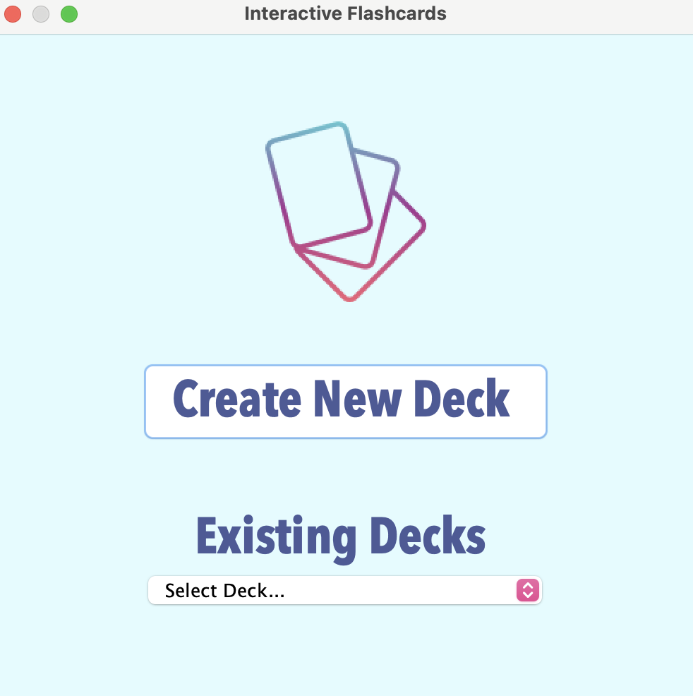

# Interactive FlashCards
For students and professionals who need a way to memorize and/or study information pertinent to their field, our Interactive Flashcard Application is a web-based application that will virtualize the outdated flashcard and provide a more efficient study algorithm for the user to allow for them to achieve their goals.

Unlike other flashcard applications like quizlet, the goal of our application is to drill our user on flashcard given their strengths and weaknesses rather then allow the user to judge their own grasp on the information. Our application enable users to assess themselves using custom created flashcards and then benefit from an algorithm that decides what fields they are strong in, where they need more improvement, and fields that need to be completely overhauled.



# How to run
Check the releases tab for the most recent binary/zip
- Download .zip file
- Unzip file to desired location.
### Run on Mac/Linux
Verifying Java (openJDK) installation to auto-run JAR file
- Verify you have Java (openJDK version "20"+) in terminal
- You should see "openJDK version {20-22}"
```
 java -version
```
- If needed, install java (openJDK version "20"+) using brew in terminal
```
 brew install openJDK
```
- If needed, install brew in terminal, then install java
```
 /bin/bash -c "$(curl -fsSL https://raw.githubusercontent.com/Homebrew/install/HEAD/install.sh)"
```
Run JAR file
- In the unzipped releases file, double-click the Flashcards.jar file.
- This will launch the application.
### Run on Windows
Run EXE file
- In the unzipped releases file, double-click the Flashcards.exe file.
- This will launch the application.

# How to contribute
- This project board contains the progress of feature implementation.
- Follow this project board to know the latest status of the project: [Project Board](https://github.com/orgs/cis3296s24/projects/85)

### How to build
- Use this github repository: [Interactive Flashcards](https://github.com/cis3296s24/03-interactive-flashcards)
- Specify what branch to use for a more stable release or for cutting edge development.  
- Use IntelliJ 11
- Specify additional library to download if needed 
- What file and target to compile and run. 
- What is expected to happen when the app starts. 
